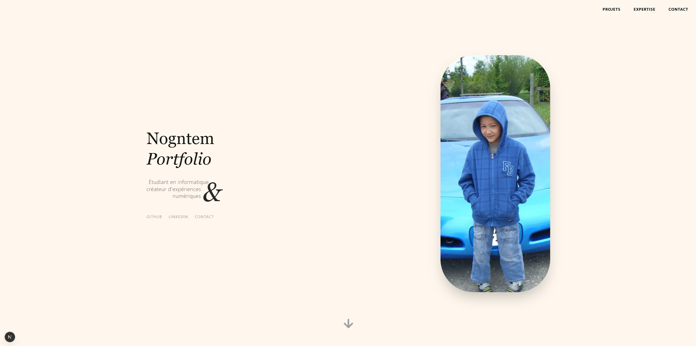

# Portfolio 2026 — Engineering & Design

**Live Demo :** [https://nogntem_portfolio.vercel.app](https://nogntem_portfolio.vercel.app)



## Concept

Architecture "One Page" inspirée du design éditorial suisse. L'objectif est de démontrer une maîtrise technique (Next.js 14) au service d'une direction artistique minimaliste.
Pas de librairie UI lourde, composants construits "from scratch".

## Stack Technique

| Scope | Technologies |
| :--- | :--- |
| **Core** | `Next.js 14 (App Router)`, `TypeScript` |
| **Style** | `Tailwind CSS` |
| **Motion** | `Framer Motion` (Scroll, Gestures) |
| **Font** | `Geist Sans`, `Geist Mono`, `Playfair Display` |

## Structure du Projet

Architecture modulaire séparant la logique, les composants UI et les données.

```bash
src/
├── app/
│   ├── layout.tsx      # Configuration globale (Fonts, Metadata)
│   ├── page.tsx        # Point d'entrée unique
│   └── globals.css     # Variables CSS & Animations custom
├── components/
│   ├── Hero.tsx        # Intro & Status
│   ├── Navbar.tsx      # Navigation contextuelle (Scroll aware)
│   ├── Projects.tsx    # Grille de projets
│   ├── Stack.tsx       # Marquee infini & Specs
│   └── Contact.tsx     # Footer
└── public/             # Assets statiques